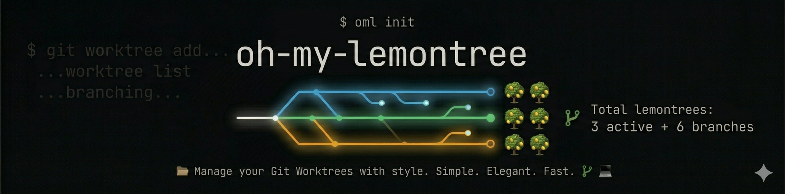

<p align="center">
  
</p>

# 🌳 oh-my-worktree

**English** | [Korean](./README.ko.md)

> Git worktree manager with a beautiful TUI — inspired by the oh-my-\* family

Manage git worktrees with ease. Create, switch, and clean up worktrees with config-driven automation, monorepo support, and built-in health checks.

## Features

- **TUI mode** — interactive terminal UI (`omw`)
- **CLI mode** — scriptable commands (`omw add`, `omw list`, etc.)
- **Config-driven** — per-repo hooks, file copying, symlinks
- **Monorepo support** — auto-detect packages, per-package hooks, focus tracking
- **Health checks** — `omw doctor` diagnoses worktree issues
- **Centralized worktrees** — all worktrees under `~/.omw/worktrees/` by default
- **Smart cleanup** — auto-detect and remove merged worktrees
- **Themes** — 6 built-in color themes (OpenCode, Tokyo Night, Dracula, Nord, Catppuccin, GitHub Dark)
- **Templates** — reusable worktree presets (`omw add --template review`)
- **Cross-worktree exec** — run commands across all worktrees (`omw exec "bun test"`)
- **GitHub PR integration** — create worktrees from PRs (`omw add --pr 123`)
- **Fuzzy branch picker** — interactive branch selection in TUI with type-ahead filtering
- **Lifecycle management** — auto-detect stale/merged worktrees, configurable limits
- **Shared dependencies** — save disk with hardlink/symlink strategies for `node_modules`
- **Worktree diff** — compare changes between worktrees (`omw diff feature/a feature/b`)
- **Pin protection** — protect worktrees from auto-cleanup (`omw pin`)
- **Activity log** — track create/delete/switch/rename/archive/import events (`omw log`)
- **Archive** — preserve worktree changes as patches before removal (`omw archive`)
- **Branch rename** — rename worktree branches with metadata migration (`omw rename`)
- **Clone & init** — clone repos with omw config initialization (`omw clone`)
- **Import worktrees** — adopt manually-created worktrees (`omw import`)
- **Detail view** — expanded worktree info with commits, diff stats, upstream status (TUI)
- **Bulk actions** — multi-select and batch operations on worktrees (TUI)
- **Toast notifications** — non-blocking operation feedback (TUI)
- **Shell completions** — tab completion for bash/zsh/fish (`omw shell-init --completions`)
- **Config profiles** — switch between configuration sets (`omw config --profiles`)
- **Tmux sessions** — auto-create/kill tmux sessions per worktree with layout templates (`omw session`)
- **AI agent init** — create config by default or install omw skill for Claude Code, Codex, OpenCode (`omw init`, `omw init --skill`)

## Requirements

- [Bun](https://bun.sh) runtime
- git 2.17+
- macOS or Linux
- [gh CLI](https://cli.github.com) (optional, for `--pr` flag)
- [tmux](https://github.com/tmux/tmux) (optional, for `omw session`)

## Installation

### Homebrew (macOS/Linux)

```bash
brew tap getsolaris/tap
brew install oh-my-worktree
```

### curl (one-liner)

```bash
curl -fsSL https://raw.githubusercontent.com/getsolaris/oh-my-worktree/main/install.sh | bash
```

### npm / bun

```bash
bun install -g oh-my-worktree
# or
npm install -g oh-my-worktree
```

## Local Development

For local contributor testing, run the repo directly with Bun:

```bash
bun install
bun run src/index.ts
bun run src/index.ts <cmd>
bun run typecheck
bun test
bun run build
```

Prefer targeted tests first when you change covered code, then run the full checks before opening a PR. If you change CLI or TUI behavior, manually run the affected flows locally as well.

## Quick Start

```bash
# Launch TUI
omw

# List worktrees
omw list

# Create a new worktree
omw add feature/my-feature

# Create with monorepo focus
omw add feature/my-feature --focus apps/web,apps/api

# Create from a GitHub PR
omw add --pr 123

# Use a template
omw add feature/login --template review

# Pin a worktree to protect from cleanup
omw pin feature/important --reason "active sprint"

# View activity log
omw log

# Archive worktree changes before removing
omw archive feature/done --yes

# Rename a worktree branch
omw rename old-name new-name

# Clone and initialize omw
omw clone https://github.com/user/repo.git

# Import an existing worktree
omw import /path/to/worktree

# Open/attach tmux session for a worktree
omw session feature/my-feature

# Create worktree with tmux session
omw add feature/new --session

# Run command across all worktrees
omw exec "bun test"

# Compare two worktrees
omw diff feature/a feature/b --stat

# Check worktree health
omw doctor

# Switch to a worktree (requires shell integration)
omw switch feature/my-feature

# Remove a worktree
omw remove feature/my-feature --yes

# Clean up merged worktrees
omw clean --dry-run

# Initialize config file
omw init

# Generate AI agent skill file
omw init --skill claude-code
```

## TUI Usage

Launch with `omw` (no arguments).

### Keyboard Shortcuts

| Key       | Action                 |
| --------- | ---------------------- |
| `j` / `k` | Navigate worktree list |
| `a`       | Add worktree           |
| `d`       | Delete worktree        |
| `h`       | Doctor (health check)  |
| `Enter`   | Open detail view       |
| `Escape`  | Close detail view      |
| `Space`   | Toggle worktree selection |
| `Ctrl+A`  | Select all worktrees   |
| `x`       | Bulk actions menu      |
| `r`       | Refresh list           |
| `Ctrl+P`  | Command palette        |
| `?`       | Help                   |
| `q`       | Quit                   |

### Command Palette (`Ctrl+P`)

Searchable command menu with:

- Add / Delete / Refresh worktrees
- Run Doctor
- Open Config
- Switch theme
- Quit

Type to filter, `↑↓` to navigate, `Enter` to execute, `Esc` to close.

### Worktree Creation Flow

1. Press `a` to open the Create view
2. Start typing a branch name — matching branches appear as you type
3. Use `↑↓` to select from suggestions, or keep typing for a new branch
4. Press `Tab` to switch to the Focus field (optional)
5. Type focus paths (e.g. `apps/web,apps/api`)
6. Press `Enter` to preview
7. Press `Enter` to confirm

The fuzzy branch picker shows local and remote branches sorted by last commit date, filtered in real-time as you type.

After creation, the configured `copyFiles`, `linkFiles`, `postCreate` hooks, and monorepo hooks run automatically.

### Doctor View

Press `h` to open the Doctor tab. Shows health check results:

- ✓ Git version check
- ✓ Config validation
- ✓ Stale worktree detection
- ✓ Orphaned directory detection
- ✓ Lock status check
- ✓ Dirty worktree detection

Press `r` to recheck, `Esc` to go back.

## CLI Commands

| Command                  | Description                          |
| ------------------------ | ------------------------------------ |
| `omw`                    | Launch TUI                           |
| `omw list`               | List all worktrees (with focus info) |
| `omw add <branch>`       | Create worktree                      |
| `omw remove <branch>`    | Remove worktree                      |
| `omw switch <branch>`    | Switch to worktree                   |
| `omw clean`              | Remove merged worktrees              |
| `omw doctor`             | Check worktree health                |
| `omw config`             | Manage configuration                 |
| `omw exec <command>`     | Run command in each worktree         |
| `omw diff <ref1> [ref2]` | Diff between worktrees/branches      |
| `omw pin <branch>`       | Pin/unpin worktree (protect from cleanup) |
| `omw log`                | Show worktree activity log           |
| `omw archive <branch>`   | Archive changes and optionally remove |
| `omw rename <old> <new>` | Rename worktree branch               |
| `omw clone <url>`        | Clone repo and initialize omw        |
| `omw import <path>`      | Adopt worktree with omw metadata     |
| `omw session [branch]`   | Manage tmux sessions for worktrees   |
| `omw init`               | Initialize config or install AI agent skills |

### `omw add`

```bash
omw add feature/login                        # Create branch if needed + worktree
omw add feature/login --base main            # New branches start from main
omw add existing-branch                      # Worktree for existing branch

# Monorepo: create with focus packages
omw add feature/login --focus apps/web,apps/api
omw add feature/login --focus apps/web --focus apps/api

# Use a template
omw add feature/login --template review

# Create from a GitHub PR (requires gh CLI)
omw add --pr 123
omw add --pr 456 --template review
```

### `omw doctor`

```bash
omw doctor              # Human-readable output
omw doctor --json       # JSON output for scripting
```

Exit code: `0` if healthy, `1` if any warnings or errors.

```
oh-my-worktree doctor

✓ Git version: 2.39.0 (>= 2.17 required)
✓ Configuration: valid
✓ Stale worktrees: none
✓ Orphaned directories: none
✓ Worktree locks: all clear
✓ Dirty worktrees: none

All checks passed.
```

### `omw list`

```bash
omw list                # Table with Focus column
omw list --json         # JSON with focus array
omw list --porcelain    # Machine-readable
```

Output includes a `Focus` column showing monorepo focus paths per worktree.

### `omw remove`

```bash
omw remove feature/login               # Remove by branch name
omw remove feature/login --force        # Force remove (dirty worktree)
omw remove feature/login --yes          # Skip confirmation
```

### `omw clean`

```bash
omw clean --dry-run    # Preview what would be removed
omw clean              # Remove all merged worktrees
omw clean --stale      # Also show stale worktrees (uses lifecycle config)
```

### `omw exec`

Run a shell command in every non-main worktree.

```bash
omw exec "bun test"                   # Run in all worktrees (sequential)
omw exec "bun test" --parallel        # Run in parallel
omw exec "git pull" --all             # Across all configured repos
omw exec "bun install" --dirty        # Only dirty worktrees
omw exec "git rebase main" --behind   # Only worktrees behind upstream
omw exec "bun test" --json            # JSON output
```

| Flag                | Description                           |
| ------------------- | ------------------------------------- |
| `--parallel` / `-p` | Run commands in parallel              |
| `--all` / `-a`      | Include all configured repos          |
| `--dirty`           | Only run in dirty worktrees           |
| `--clean`           | Only run in clean worktrees           |
| `--behind`          | Only run in worktrees behind upstream |
| `--json` / `-j`     | Output results as JSON                |

Environment variables available in commands: `OMW_BRANCH`, `OMW_WORKTREE_PATH`, `OMW_REPO_PATH`.

### `omw diff`

Show diff between two worktree branches.

```bash
omw diff feature/a feature/b         # Full diff
omw diff feature/a feature/b --stat  # Diffstat summary
omw diff feature/a --name-only       # Changed file names only
omw diff feature/a                   # Compare against current HEAD
```

### `omw pin`

```bash
omw pin feature/auth --reason "active sprint"  # Pin with reason
omw pin --list                                  # List pinned worktrees
omw pin --list --json                           # JSON output
omw unpin feature/auth                          # Unpin
```

Pinned worktrees are excluded from `omw clean` and lifecycle auto-cleanup.

### `omw log`

```bash
omw log                # Show last 20 events
omw log --limit 50     # Show last 50 events
omw log --json         # JSON output
omw log --clear        # Clear activity log
```

Events are color-coded: create (green), delete (red), switch (blue), rename (yellow), archive (magenta), import (cyan).

### `omw archive`

```bash
omw archive feature/done --yes       # Archive and remove
omw archive feature/wip --keep       # Archive without removing
omw archive --list                   # List all archives
omw archive --list --json            # JSON output
```

Archives are stored as patch files in `~/.omw/archives/`.

### `omw rename`

```bash
omw rename old-branch new-branch             # Rename branch
omw rename old-branch new-branch --move-path # Also move worktree directory
```

### `omw clone`

```bash
omw clone https://github.com/user/repo.git              # Clone and init
omw clone https://github.com/user/repo.git ./my-dir     # Custom target path
omw clone https://github.com/user/repo.git --template review # Apply template
omw clone https://github.com/user/repo.git --no-init-config  # Skip config init
```

### `omw import`

```bash
omw import /path/to/worktree                           # Adopt worktree
omw import /path/to/worktree --focus apps/web,apps/api # With focus
omw import /path/to/worktree --pin                     # Pin immediately
```

### `omw session`

Manage tmux sessions for worktrees. Requires tmux.

```bash
omw session feature/auth              # Open/attach session (create if needed)
omw session feature/auth --layout api # Use named layout from config
omw session --list                    # List active omw sessions
omw session --list --json             # JSON output
omw session feature/auth --kill       # Kill session for worktree
omw session --kill-all                # Kill all omw sessions
```

Sessions are auto-created/killed when `sessions.autoCreate` / `sessions.autoKill` are enabled in config.

```bash
# Create worktree with tmux session
omw add feature/login --session
omw add feature/login --session --layout api
```

When `sessions.enabled` is `true` and you're inside tmux, `omw switch` automatically switches to the target worktree's tmux session.

### `omw init`

Initialize omw config by default, or install omw skill for AI coding agents so they can use omw commands.

```bash
omw init                         # → ~/.config/oh-my-worktree/config.json
omw init --skill claude-code   # → ~/.claude/skills/omw/
omw init --skill codex          # → ~/.agents/skills/omw/
omw init --skill opencode       # → ~/.config/opencode/skill/omw/
```

| Platform | Skill Path |
|----------|-----------|
| `claude-code` | `~/.claude/skills/omw/` |
| `codex` | `~/.agents/skills/omw/` |
| `opencode` | `~/.config/opencode/skill/omw/` |

Each skill directory contains:
- `SKILL.md` — overview and common workflows
- `references/` — detailed per-command documentation (21 files)

Without `--skill`, the command reuses the normal config initializer and creates only `config.json`.
The command is idempotent — running it again updates the skill directory.

## Configuration

Config file: `~/.config/oh-my-worktree/config.json`

Initialize with: `omw config --init`

### Full Example

```json
{
  "$schema": "https://raw.githubusercontent.com/getsolaris/oh-my-worktree/main/schema.json",
  "version": 1,
  "theme": "dracula",
  "defaults": {
    "worktreeDir": "~/.omw/worktrees/{repo}-{branch}",
    "copyFiles": [".env"],
    "linkFiles": ["node_modules"],
    "postCreate": ["bun install"],
    "postRemove": [],
    "sharedDeps": {
      "strategy": "hardlink",
      "paths": ["node_modules"],
      "invalidateOn": ["package.json", "bun.lockb"]
    }
  },
  "templates": {
    "review": {
      "copyFiles": [".env.local"],
      "postCreate": ["bun install", "bun run build"],
      "autoUpstream": true
    },
    "hotfix": {
      "base": "main",
      "copyFiles": [".env.production"],
      "postCreate": ["bun install"]
    },
    "experiment": {
      "worktreeDir": "~/tmp/experiments/{branch}",
      "postRemove": []
    }
  },
  "lifecycle": {
    "autoCleanMerged": true,
    "staleAfterDays": 14,
    "maxWorktrees": 10
  },
  "sessions": {
    "enabled": true,
    "autoCreate": false,
    "autoKill": true,
    "prefix": "omw",
    "defaultLayout": "dev",
    "layouts": {
      "dev": {
        "windows": [
          { "name": "editor", "command": "$EDITOR ." },
          { "name": "dev", "command": "bun dev" },
          { "name": "test", "command": "bun test --watch" }
        ]
      },
      "minimal": {
        "windows": [
          { "name": "shell" }
        ]
      }
    }
  },
  "repos": [
    {
      "path": "/Users/me/dev/frontend",
      "copyFiles": [".env", ".env.local"],
      "linkFiles": ["node_modules", ".next"],
      "postCreate": ["bun install", "bun run build"]
    },
    {
      "path": "/Users/me/dev/backend",
      "copyFiles": [".env"],
      "postCreate": ["pip install -r requirements.txt"]
    },
    {
      "path": "/Users/me/dev/monorepo",
      "copyFiles": [".env"],
      "postCreate": ["pnpm install"],
      "monorepo": {
        "autoDetect": true,
        "extraPatterns": ["apps/*/*"],
        "hooks": [
          {
            "glob": "apps/web",
            "copyFiles": [".env"],
            "postCreate": ["cd {packagePath} && pnpm install"]
          },
          {
            "glob": "apps/api",
            "copyFiles": [".env"],
            "linkFiles": ["node_modules"],
            "postCreate": ["cd {packagePath} && pnpm install && pnpm build"]
          }
        ]
      }
    }
  ]
}
```

### Config Fields

#### `defaults`

All repos inherit these unless overridden.

| Field         | Type       | Default                            | Description                             |
| ------------- | ---------- | ---------------------------------- | --------------------------------------- |
| `worktreeDir` | `string`   | `~/.omw/worktrees/{repo}-{branch}` | Worktree directory pattern              |
| `copyFiles`   | `string[]` | `[]`                               | Files to copy from main repo            |
| `linkFiles`   | `string[]` | `[]`                               | Files/dirs to symlink (saves disk)      |
| `postCreate`  | `string[]` | `[]`                               | Commands to run after worktree creation |
| `postRemove`  | `string[]` | `[]`                               | Commands to run before worktree removal |

#### `repos[]`

Per-repo overrides. Each entry requires `path`.

| Field         | Type       | Required | Description                         |
| ------------- | ---------- | -------- | ----------------------------------- |
| `path`        | `string`   | Yes      | Absolute path to the repository     |
| `worktreeDir` | `string`   | No       | Override default worktree directory |
| `copyFiles`   | `string[]` | No       | Override default copy files         |
| `linkFiles`   | `string[]` | No       | Override default link files         |
| `postCreate`  | `string[]` | No       | Override default post-create hooks  |
| `postRemove`  | `string[]` | No       | Override default post-remove hooks  |
| `monorepo`    | `object`   | No       | Monorepo support config             |

#### `monorepo`

Universal monorepo support. Auto-detects packages from workspace config files and supports per-package hooks.

```json
{
  "monorepo": {
    "autoDetect": true,
    "extraPatterns": ["apps/*/*"],
    "hooks": [
      {
        "glob": "apps/mobile/*",
        "copyFiles": [".env"],
        "linkFiles": ["node_modules"],
        "postCreate": ["cd {packagePath} && pnpm install"]
      }
    ]
  }
}
```

| Field           | Type       | Default | Description                               |
| --------------- | ---------- | ------- | ----------------------------------------- |
| `autoDetect`    | `boolean`  | `true`  | Auto-detect monorepo tools                |
| `extraPatterns` | `string[]` | `[]`    | Extra glob patterns for package discovery |
| `hooks`         | `array`    | `[]`    | Per-package hook definitions              |

**Auto-detection** supports: pnpm workspaces, Turborepo, Nx, Lerna, npm/yarn workspaces.

**`extraPatterns`** catches packages not covered by auto-detection. For example, if your `pnpm-workspace.yaml` only covers `packages/*` but you also have apps at `apps/frontend/dashboard`, use `extraPatterns: ["apps/*/*"]`.

#### `monorepo.hooks[]`

Per-package hooks matched by glob pattern against focus paths.

| Field        | Type       | Required | Description                                                                    |
| ------------ | ---------- | -------- | ------------------------------------------------------------------------------ |
| `glob`       | `string`   | Yes      | Glob to match focus paths (e.g. `apps/*`, `apps/mobile/*`)                      |
| `copyFiles`  | `string[]` | No       | Files to copy within the matched package directory                             |
| `linkFiles`  | `string[]` | No       | Files/dirs to symlink within the matched package directory                     |
| `postCreate` | `string[]` | No       | Commands to run after creation. Supports `{packagePath}`, `{repo}`, `{branch}` |
| `postRemove` | `string[]` | No       | Commands to run before removal                                                 |

Hooks execute in declaration order, after the repo-level `postCreate`/`postRemove`.

**`copyFiles`/`linkFiles` in hooks** operate on the **package subdirectory**, not the repo root. For example, with `glob: "apps/mobile/*"` and `copyFiles: [".env"]`, the `.env` file is copied from `<main-repo>/apps/mobile/ios/.env` to `<worktree>/apps/mobile/ios/.env`.

#### `templates`

Named presets for worktree creation. Each template can override any default field.

```json
{
  "templates": {
    "review": {
      "copyFiles": [".env.local"],
      "postCreate": ["bun install", "bun run build"],
      "autoUpstream": true
    },
    "hotfix": {
      "base": "main",
      "copyFiles": [".env.production"],
      "postCreate": ["bun install"]
    }
  }
}
```

| Field          | Type       | Description                        |
| -------------- | ---------- | ---------------------------------- |
| `worktreeDir`  | `string`   | Override worktree directory        |
| `copyFiles`    | `string[]` | Override files to copy             |
| `linkFiles`    | `string[]` | Override files to symlink          |
| `postCreate`   | `string[]` | Override post-create hooks         |
| `postRemove`   | `string[]` | Override post-remove hooks         |
| `autoUpstream` | `boolean`  | Override upstream tracking         |
| `base`         | `string`   | Default base branch for newly created branches |

Usage: `omw add feature/login --template review`

Template values override the resolved repo config. The `base` field sets a default for `--base` if not explicitly provided.

#### `lifecycle`

Automatic worktree lifecycle management. Used by `omw clean --stale`.

```json
{
  "lifecycle": {
    "autoCleanMerged": true,
    "staleAfterDays": 14,
    "maxWorktrees": 10
  }
}
```

| Field             | Type      | Default | Description                                 |
| ----------------- | --------- | ------- | ------------------------------------------- |
| `autoCleanMerged` | `boolean` | `false` | Flag merged worktrees for cleanup           |
| `staleAfterDays`  | `number`  | —       | Days of inactivity before flagging as stale |
| `maxWorktrees`    | `number`  | —       | Warn when exceeding this count              |

#### Config Profiles

Switch between different configuration sets.

```bash
omw config --profiles                    # List profiles
omw config --profile work --activate     # Activate profile
omw config --profile personal --delete   # Delete profile
```

#### `sessions`

Tmux session management for worktrees.

```json
{
  "sessions": {
    "enabled": true,
    "autoCreate": true,
    "autoKill": true,
    "prefix": "omw",
    "defaultLayout": "dev",
    "layouts": {
      "dev": {
        "windows": [
          { "name": "editor", "command": "$EDITOR ." },
          { "name": "dev", "command": "bun dev" },
          { "name": "test", "command": "bun test --watch" }
        ]
      }
    }
  }
}
```

| Field           | Type      | Default | Description                                        |
| --------------- | --------- | ------- | -------------------------------------------------- |
| `enabled`       | `boolean` | `false` | Enable session integration (auto-switch in tmux)   |
| `autoCreate`    | `boolean` | `false` | Auto-create tmux session on `omw add`              |
| `autoKill`      | `boolean` | `false` | Auto-kill tmux session on `omw remove`             |
| `prefix`        | `string`  | `"omw"` | Prefix for tmux session names                      |
| `defaultLayout` | `string`  | —       | Default layout name for new sessions               |
| `layouts`       | `object`  | `{}`    | Named layouts with window definitions              |

**Layout windows:**

| Field     | Type     | Required | Description                    |
| --------- | -------- | -------- | ------------------------------ |
| `name`    | `string` | Yes      | Window name                    |
| `command` | `string` | No       | Command to run in the window   |

Session naming: branch `feat/auth-token` → tmux session `omw_feat-auth-token`.

#### `sharedDeps`

Share dependencies between main repo and worktrees to save disk space. Can be set in `defaults` or per-repo.

```json
{
  "defaults": {
    "sharedDeps": {
      "strategy": "hardlink",
      "paths": ["node_modules"],
      "invalidateOn": ["package.json", "bun.lockb"]
    }
  }
}
```

| Field          | Type       | Default     | Description                                |
| -------------- | ---------- | ----------- | ------------------------------------------ |
| `strategy`     | `string`   | `"symlink"` | `"hardlink"`, `"symlink"`, or `"copy"`     |
| `paths`        | `string[]` | `[]`        | Directories/files to share                 |
| `invalidateOn` | `string[]` | `[]`        | Files that trigger re-sharing when changed |

**Strategies:**

- `hardlink` — Create hard links for each file (saves disk, each worktree can modify independently for files that get rewritten)
- `symlink` — Create a symlink to the source directory (most disk savings, shared state)
- `copy` — Fall back to regular copy

### `--focus` Flag

Track which monorepo packages a worktree is working on.

```bash
omw add feature/login --focus apps/web,apps/api
```

- Supports comma-separated, space-separated, or multiple `--focus` flags
- Focus metadata is stored in git internals (not in the worktree root)
- `omw list` shows focus paths per worktree
- Monorepo hooks only fire for matching focus paths
- Focus is optional — omitting it creates a normal worktree

### Template Variables

Available in `worktreeDir` and monorepo hook commands:

| Variable        | Description                                | Example        |
| --------------- | ------------------------------------------ | -------------- |
| `{repo}`        | Repository directory name                  | `my-app`       |
| `{branch}`      | Branch name (`/` replaced with `-`)        | `feature-auth` |
| `{packagePath}` | Matched package path (monorepo hooks only) | `apps/web`     |
| `~`             | Home directory (only at path start)        | `/Users/me`    |

### Priority

Per-repo settings completely replace defaults (no merging):

```
repos[].copyFiles exists?  →  use repos[].copyFiles
repos[].copyFiles missing? →  use defaults.copyFiles
defaults.copyFiles missing? → use [] (empty)
```

### Themes

Set via config or command palette (`Ctrl+P`):

```json
{ "theme": "tokyo-night" }
```

Available: `opencode`, `tokyo-night`, `dracula`, `nord`, `catppuccin`, `github-dark`

## Shell Integration

Use `omw shell-init` to install shell integration for `omw switch`.

### Completions

```bash
# Add completions (bash)
eval "$(omw shell-init --completions bash)"

# Add completions (zsh)
eval "$(omw shell-init --completions zsh)"

# Add completions (fish)
omw shell-init --completions fish | source
```

### Examples

```bash
# zsh
echo 'eval "$(omw shell-init zsh)"' >> ~/.zshrc
source ~/.zshrc

# bash
echo 'eval "$(omw shell-init bash)"' >> ~/.bashrc
source ~/.bashrc

# fish
omw shell-init fish >> ~/.config/fish/config.fish
source ~/.config/fish/config.fish
```

You can also preview the generated wrapper before saving it:

```bash
omw shell-init zsh
```

## License

MIT © getsolaris
